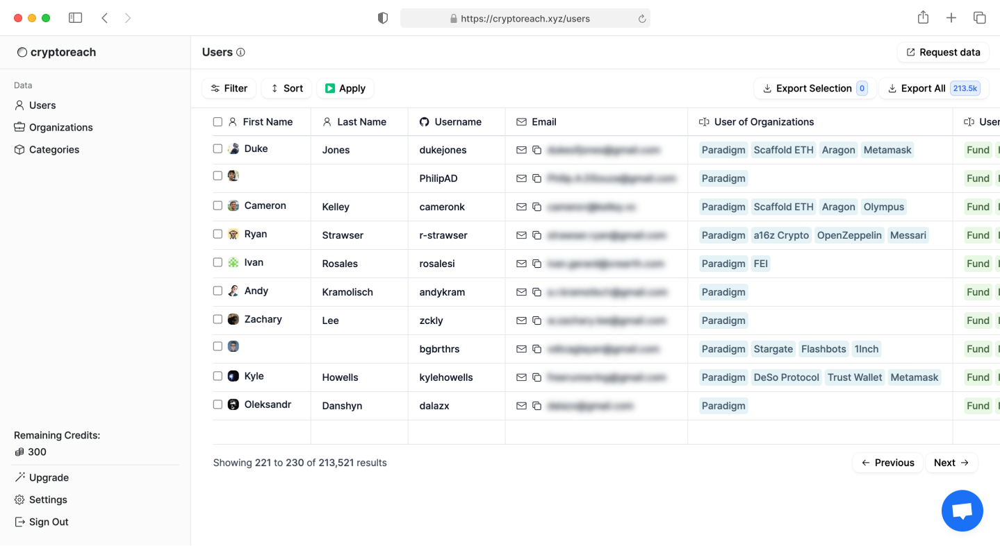

<a name="readme-top"></a>

<br />
<div align="center">

<h3 align="center">CryptoReach - Web3 Leads Database SaaS</h3>

  <p align="center">
    Web3 lead database with +230k carefully curated leads. Used by leading crypto companies like Moralis and Nansen
    <br />
    <br />
    <a href="https://cryptoreach.xyz">View Demo</a>
    ·
    <a href="https://github.com/ntegrals/cryptoreach/issues">Report Bug</a>
    ·
    <a href="https://github.com/ntegrals/cryptoreach/issues">Request Feature</a>
  </p>
</div>
<a href="https://github.com/ntegrals/cryptoreach">
    
  </a>

## Features

    ✅ A fully operational SaaS with a slick, notion inspired UI
    ✅ Built with Next.js, Supabase, Tailwind and Stripe
    ✅ Deployed on Vercel
    ✅ Can be used as a template for your own data-centric SaaS

## Demo

You can test the SaaS here: [https://cryptoreach.xyz](https://cryptoreach.xyz)

## Installation

1. Clone the repo

   ```sh
   git clone https://github.com/ntegrals/cryptoreach
   ```

2. Head over to [the underlying SaaS template](https://github.com/vercel/nextjs-subscription-payments) to set up Supabase and Stripe.


3. Install the dependencies
   ```sh
   npm install
   ```
4. Run the app
   ```
   npm run dev
   ```
5. Deploy to vercel

## Contact

Hi! Thanks for checking out and using this library. If you are interested in discussing your project, require mentorship, consider hiring me, or just wanna chat - I'm happy to talk.

You can send me an email to get in touch: j.schoen@mail.com or message me on Twitter: [@julianschoen](https://twitter.com/julianschoen)

If you'd just want to give something back, I've got a Buy Me A Coffee account:

<a href="https://www.buymeacoffee.com/ntegrals">

</a>

Thanks and have an awesome day 👋

## Disclaimer

CryptoReach, is an experimental application and is provided "as-is" without any warranty, express or implied. By using this software, you agree to assume all risks associated with its use, including but not limited to data loss, system failure, or any other issues that may arise.

The developers and contributors of this project do not accept any responsibility or liability for any losses, damages, or other consequences that may occur as a result of using this software. You are solely responsible for any decisions and actions taken based on the information provided by CryptoReach.

By using CryptoReach, you agree to indemnify, defend, and hold harmless the developers, contributors, and any affiliated parties from and against any and all claims, damages, losses, liabilities, costs, and expenses (including reasonable attorneys' fees) arising from your use of this software or your violation of these terms.

<!-- LICENSE -->

## License

Distributed under the MIT License. See `LICENSE` for more information.